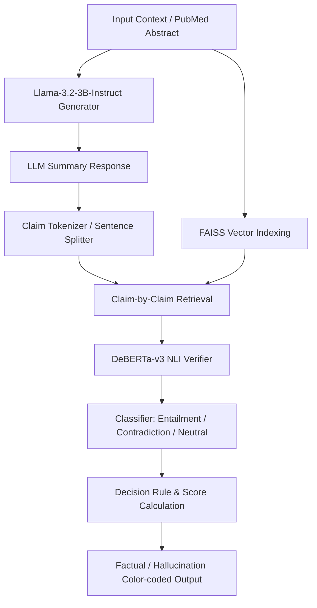

# RAG-Based Clinical Hallucination Detection Model

An interactive, end-to-end Natural Language Processing (NLP) system designed to generate clinical text summaries and automatically detect factual hallucinations or contradictions. The system uses a **Retrieval-Augmented Generation (RAG)** pipeline combined with a **Natural Language Inference (NLI)** verifier, wrapped in an interactive GUI.

---

## 🚀 Key Features

*   **PubMed-Tuned Embeddings:** Uses `NeuML/pubmedbert-base-embeddings` to generate domain-specific vectors for accurate semantic searches over medical literature.
*   **Controllable Hallucination Generator:** Employs quantized `meta-llama/Llama-3.2-3B-Instruct` (via 4-bit quantization) with a prompt strategy that randomly introduces hallucinations. This allows robust testing and benchmarking of the verification pipeline.
*   **Dual-Model Verification Pipeline:**
    *   **Retrieval:** FAISS vector store indexes the original clinical context to retrieve the top 3 most relevant context chunks for each generated claim.
    *   **Verification:** A DeBERTa cross-encoder (`cross-encoder/nli-deberta-v3-base`) performs Natural Language Inference to classify the claim as **Entailment**, **Contradiction**, or **Neutral** relative to the retrieved context.
*   **Interactive Native GUI:** Built completely inside Jupyter/Google Colab using `ipywidgets`. Allows users to fetch random abstracts from PubMed or input their own text, run the LLM generator, and see real-time claim-by-claim hallucination reports.

---

## 🛠️ System Architecture & Workflow



### Hallucination Detection Logic
For each sentence (claim) in the generated response:
1.  **Retrieve:** Fetch the most relevant document chunks from the FAISS database.
2.  **Evaluate:** Pass the combined chunks and the claim to the NLI cross-encoder.
3.  **Calculate Ratio:** An Entailment-vs-Contradiction ratio is calculated using:
    $$\text{Ratio} = \frac{\text{Prob(Entailment)}}{\text{Prob(Entailment)} + \text{Prob(Contradiction)} + \epsilon}$$
    *(where $\epsilon = 10^{-5}$ prevents division by zero)*.
4.  **Flag:** A claim is flagged as **Hallucinated** if:
    *   The contradiction probability is high ($> 0.5$).
    *   The claim is unsupported (high neutral score $> 0.7$) and the Entailment-vs-Contradiction ratio is low ($< 0.75$).
    *   The contradiction score is simply greater than the entailment score.

---

## 📦 Requirements & Installation

To run the pipeline locally or in Google Colab, you need a GPU-enabled runtime (e.g., **T4 GPU** or better). Install the necessary dependencies using:

```bash
pip install -q transformers accelerate bitsandbytes
pip install -q langchain langchain-community langchain-text-splitters faiss-cpu sentence-transformers
pip install -q datasets ipywidgets NLTK
```

### Hugging Face Setup
Since the project utilizes `meta-llama/Llama-3.2-3B-Instruct`, you must accept the model terms on Hugging Face and log in:
```python
from huggingface_hub import login
login(token="YOUR_HF_TOKEN")
```

---

## 💻 Interactive GUI Guide

1.  **Context Input Area:** Enter your own clinical context or medical case study.
2.  **Load Random PubMed Abstract:** Click this button to pull a real abstract stream from the `uiyunkim-hub/pubmed-abstract` dataset.
3.  **Generate & Detect:** Generates a summary (with a 50% probability of containing hallucinations) and checks it:
    *   **Green boxes (✅ Factual):** Claims supported by the source context.
    *   **Red boxes (🚨 Hallucinated):** Claims flagged as false, contradiction, or unsupported.

---

## 📂 File Structure

*   [`clinical_hallucination_detection_final.ipynb`](file:///c:/Users/adity/Downloads/SNLP_Project/clinical_hallucination_detection_final.ipynb): The main production notebook containing the finalized pipeline, UI widgets, and logic fixes.
*   [`clinical_hallucination_detection_V 02.ipynb`](file:///c:/Users/adity/Downloads/SNLP_Project/clinical_hallucination_detection_V%2002.ipynb): Initial prototype notebook.
*   [`.gitignore`](file:///c:/Users/adity/Downloads/SNLP_Project/.gitignore): Excludes checkpoints, local caches, pycache, and virtual environments.
*   [`README.md`](file:///c:/Users/adity/Downloads/SNLP_Project/README.md): This documentation file.
